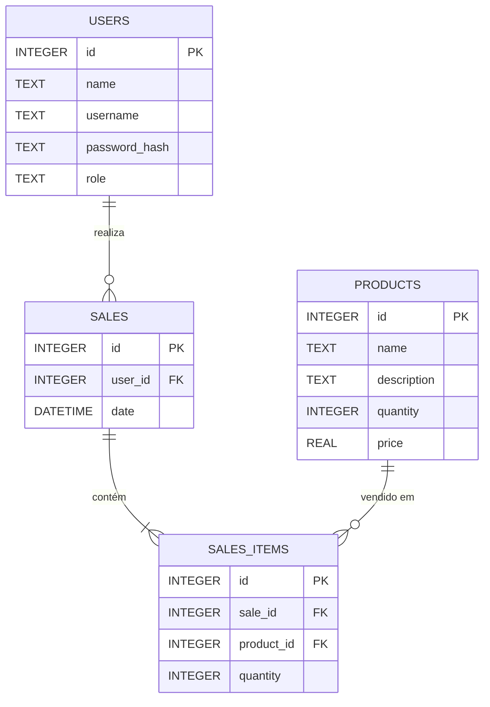

# Diagrama do Banco de Dados Relacional

Este diagrama descreve a estrutura do banco de dados relacional para o aplicativo Gestor Simples.

## Tabelas

### `Users`

Armazena as informações dos usuários do sistema (administradores e vendedores).

| Coluna        | Tipo de Dado | Restrições                               | Descrição                           |
| :------------ | :----------- | :--------------------------------------- | :---------------------------------- |
| `id`          | `INTEGER`    | `PRIMARY KEY`, `AUTOINCREMENT`           | Identificador único do usuário.     |
| `name`        | `TEXT`       | `NOT NULL`                               | Nome completo do usuário.           |
| `username`    | `TEXT`       | `NOT NULL`, `UNIQUE`                     | Nome de usuário para login.         |
| `password_hash` | `TEXT`       | `NOT NULL`                               | Hash da senha do usuário.           |
| `role`        | `TEXT`       | `NOT NULL`                               | Papel do usuário ('admin' ou 'vendedor'). |

### `Products`

Armazena as informações dos produtos em estoque.

| Coluna      | Tipo de Dado | Restrições                     | Descrição                         |
| :---------- | :----------- | :----------------------------- | :-------------------------------- |
| `id`        | `INTEGER`    | `PRIMARY KEY`, `AUTOINCREMENT` | Identificador único do produto.   |
| `name`      | `TEXT`       | `NOT NULL`                     | Nome do produto.                  |
| `description` | `TEXT`       |                                | Descrição do produto.             |
| `quantity`  | `INTEGER`    | `NOT NULL`, `DEFAULT 0`        | Quantidade do produto em estoque. |
| `price`     | `REAL`       | `NOT NULL`, `DEFAULT 0.0`      | Preço unitário do produto.        |

### `Sales`

Registra todas as vendas realizadas no sistema.

| Coluna     | Tipo de Dado | Restrições                                               | Descrição                                   |
| :--------- | :----------- | :------------------------------------------------------- | :------------------------------------------ |
| `id`       | `INTEGER`    | `PRIMARY KEY`, `AUTOINCREMENT`                           | Identificador único da venda.               |
| `user_id`  | `INTEGER`    | `NOT NULL`, `FOREIGN KEY(user_id) REFERENCES Users(id)`     | ID do vendedor que realizou a venda.        |
| `date`     | `DATETIME`   | `NOT NULL`, `DEFAULT CURRENT_TIMESTAMP`                  | Data e hora em que a venda foi realizada. |

### `Sales_Items`

Armazena os itens de uma venda.

| Coluna     | Tipo de Dado | Restrições                                               | Descrição                                   |
| :--------- | :----------- | :------------------------------------------------------- | :------------------------------------------ |
| `id`       | `INTEGER`    | `PRIMARY KEY`, `AUTOINCREMENT`                           | Identificador único do item da venda.       |
| `sale_id`  | `INTEGER`    | `NOT NULL`, `FOREIGN KEY(sale_id) REFERENCES Sales(id)`   | ID da venda à qual o item pertence.         |
| `product_id` | `INTEGER`    | `NOT NULL`, `FOREIGN KEY(product_id) REFERENCES Products(id)` | ID do produto vendido.                      |
| `quantity` | `INTEGER`    | `NOT NULL`                                               | Quantidade de itens vendidos.               |

## Diagrama ER (Mermaid)

